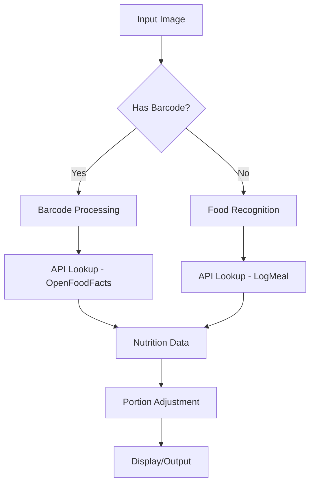

# Calories-Scan

A modern web application for tracking nutrition information and getting healthy food suggestions, built with Next.js 13+, TypeScript, and Tailwind CSS.

## Features

- 🍱 Search and view nutrition information for various foods
- 📊 Detailed nutritional breakdown (calories, protein, carbs, fat, etc.)
- 🔄 Quantity adjustment for accurate portion sizes
- 💡 Smart food alternatives suggestions based on dietary restrictions
- 🇻🇳 Special focus on Vietnamese cuisine
- 🤖 AI-powered chatbot for nutrition advice
- 📱 Responsive design for all devices
- 🔐 User authentication system

## Tech Stack

- **Framework:** Next.js 13+ (App Router)
- **Language:** TypeScript
- **Styling:** Tailwind CSS
- **UI Components:** Shadcn/ui
- **Authentication:** Built-in auth system
- **AI Integration:** Custom AI flows for food suggestions



## Getting Started

### Prerequisites

- Node.js 16.8 or later
- npm or yarn

### Installation

1. Clone the repository:
```bash
git clone https://github.com/RuleOfNight/Calories-Scan.git
cd Calories-Scan
```

2. Install dependencies:
```bash
npm install
# or
yarn install
```

3. Start the development server:
```bash
npm run dev
# or
yarn dev
```

4. Open [http://localhost:3000](http://localhost:3000) with your browser to see the application.

## Project Structure

```
📂src/
├── 📂ai/           # AI integration and flows
├── 📂app/          # Next.js app router pages
├── 📂components/   # Reusable UI components
├── 📂hooks/        # Custom React hooks
├── 📂lib/          # Utility functions
├── 📂types/        # TypeScript type definitions
└── 📄README.md/
```

## Main Features Breakdown

### Nutrition Information
- Search for any food item
- View detailed nutritional values
- Adjust portion sizes
- Quick access to common Vietnamese dishes

### Smart Food Suggestions
- Get healthy alternative suggestions
- Customize based on dietary restrictions
- Account for personal preferences
- AI-powered reasoning for suggestions

### User Dashboard
- Personal profile management
- Nutrition tracking
- Food scanning capability
- AI chatbot assistance


## Acknowledgments

- Built with [Next.js](https://nextjs.org/)
- UI components from [shadcn/ui](https://ui.shadcn.com/)
- Icons by [Lucide](https://lucide.dev/)
- Nutritional info by [LogMeal](https://api.logmeal.com/api/docs/)